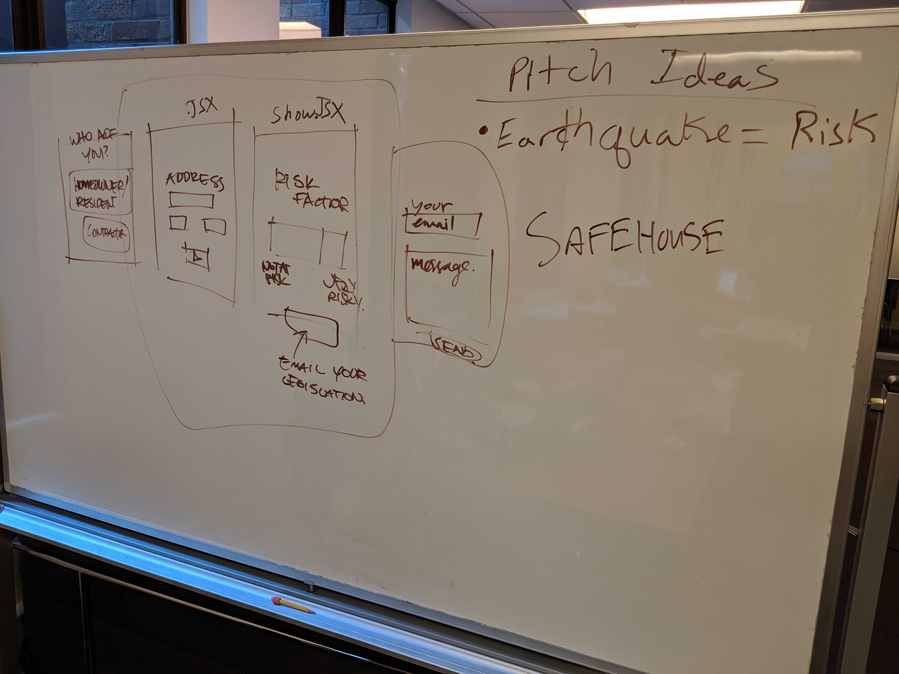
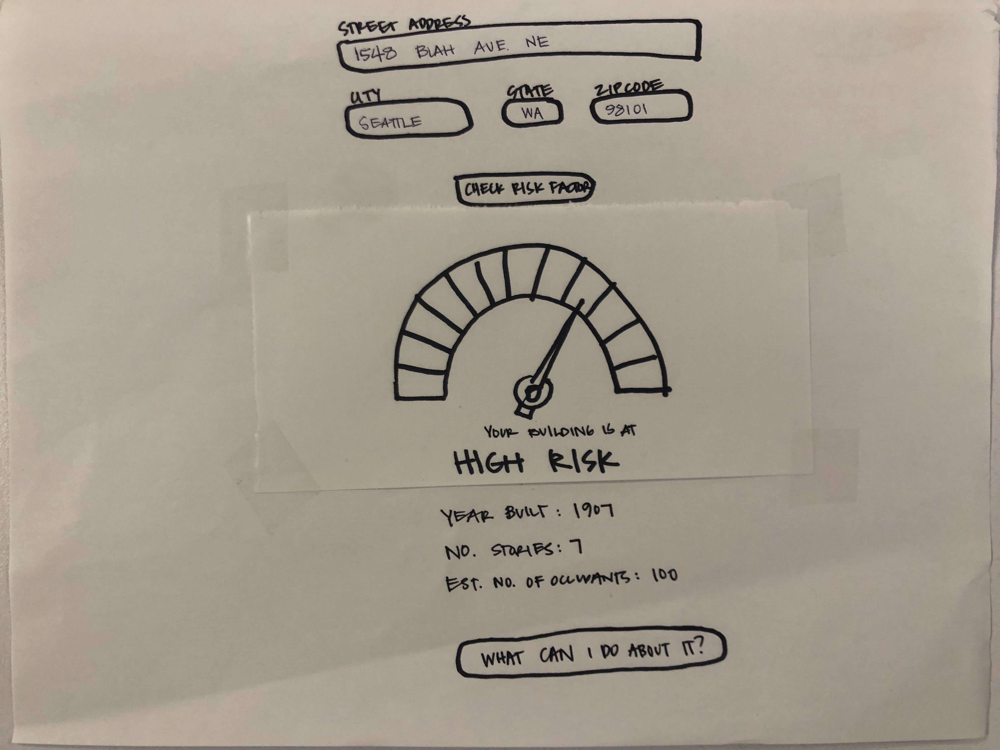
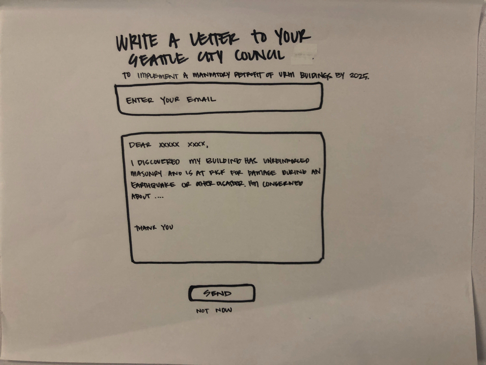

# SafeHouse🏠 - grassroots initiative for earthquake safety

## Check out a demo of the site here: https://epic-shaw-f54583.netlify.com

## Nathan Chan | July 29-30, 2019
## General Assembly - Two Day Hackathon
### Placed third overall
### Worked with two UX/UI designers and two other software developers
### The app was developed using the React.js framework. 

# Introduction
Given the most recent earthquake in Monroe, WA and the increasing likelihood of earthquakes occuring in the Greater Seattle Area, our team created an app that would allow users to identified if their Unreinforced Masonry Building (URM) is at medium risk, high risk, or critical risk in an earthquake. The project pulled from the City of Seattle's Public URM API. 

# Planning
Over the course of two days we were tasked with creating an app which uses a public API and relates to the topic of housing in Seattle. 

Our team spent the first hour generating a proposal and pitching the idea to our cohort mentors. We finally landed on the idea of SafeHouse, a grassroots initiative for earthquake safety. 

Since our team had a couple of designers, they took the lead in developing the wireframes, design, branding, and presentation. The developers turned those sketches and ideas and turned them into a reality. 

## URM API
The data was pulled from the City of Seattle's URM API at the following link.

https://data.seattle.gov/Permitting/Unreinforced-Masonry-Buildings/54qs-2h7f

## UX/UI 
Our initial efforts were documented through whiteboarding and wireframe sketches. The design team provided the web developers with the wire frames of the pages that would tell the most compelling story. 

#### Whiteboarding: 

#### Wire Frames:

Home Page:

Risk Page:

Letter Page:

## React.js
The entire web app was built using React and React-Router-DOM to create our desired user experience. React was chosen since it is a frontend library which still utilizes Javascript and provides a Single Page Application to the user. This reduces the amount of time needed to render teh page.

The Axios node library was used for the API call to retrieve the URM API database.

# Live Demo and Presentation
We presented our app, the motivation for it, and it's functionality to a panel of five judges as well as a an audience of 40. 

[Hackathon Presentation](./src/presentation/HackathonPresentation.pdf)

# Next Steps
Our project team had many ideas to continue building out the functionality of the project. Some of them include: 
1. Search Feature - including a drop down search featureas a user is typing
2. Map - includes the location in question and a map of the locations of medium, high, and critical risk locations
3. Email - providing a list of council members emails and contact information for users to quickly contact the appropriate person

# Credit To 
City of Seattle's Open Data as well as the General Assembly SEI-25 and UX/UI-26 Instructors

---

# The following info is generated with the Create-React-App node module

This project was bootstrapped with [Create React App](https://github.com/facebook/create-react-app).

## Available Scripts

In the project directory, you can run:

### `npm start`

Runs the app in the development mode. 
Open [http://localhost:3000](http://localhost:3000) to view it in the browser.

The page will reload if you make edits. 
You will also see any lint errors in the console.

### `npm test`

Launches the test runner in the interactive watch mode. 
See the section about [running tests](https://facebook.github.io/create-react-app/docs/running-tests) for more information.

### `npm run build`

Builds the app for production to the `build` folder. 
It correctly bundles React in production mode and optimizes the build for the best performance.

The build is minified and the filenames include the hashes. 
Your app is ready to be deployed!

See the section about [deployment](https://facebook.github.io/create-react-app/docs/deployment) for more information.

### `npm run eject`

**Note: this is a one-way operation. Once you `eject`, you can’t go back!**

If you aren’t satisfied with the build tool and configuration choices, you can `eject` at any time. This command will remove the single build dependency from your project.

Instead, it will copy all the configuration files and the transitive dependencies (Webpack, Babel, ESLint, etc) right into your project so you have full control over them. All of the commands except `eject` will still work, but they will point to the copied scripts so you can tweak them. At this point you’re on your own.

You don’t have to ever use `eject`. The curated feature set is suitable for small and middle deployments, and you shouldn’t feel obligated to use this feature. However we understand that this tool wouldn’t be useful if you couldn’t customize it when you are ready for it.

## Learn More

You can learn more in the [Create React App documentation](https://facebook.github.io/create-react-app/docs/getting-started).

To learn React, check out the [React documentation](https://reactjs.org/).

### Code Splitting

This section has moved here: https://facebook.github.io/create-react-app/docs/code-splitting

### Analyzing the Bundle Size

This section has moved here: https://facebook.github.io/create-react-app/docs/analyzing-the-bundle-size

### Making a Progressive Web App

This section has moved here: https://facebook.github.io/create-react-app/docs/making-a-progressive-web-app

### Advanced Configuration

This section has moved here: https://facebook.github.io/create-react-app/docs/advanced-configuration

### Deployment

This section has moved here: https://facebook.github.io/create-react-app/docs/deployment

### `npm run build` fails to minify

This section has moved here: https://facebook.github.io/create-react-app/docs/troubleshooting#npm-run-build-fails-to-minify
